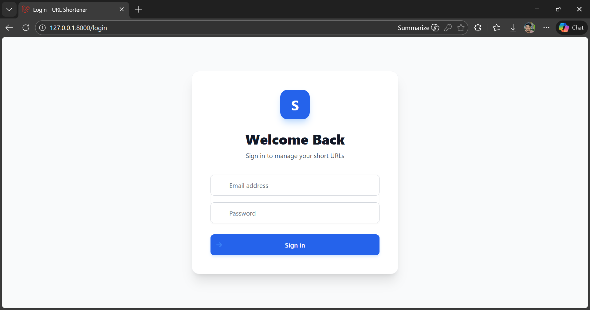
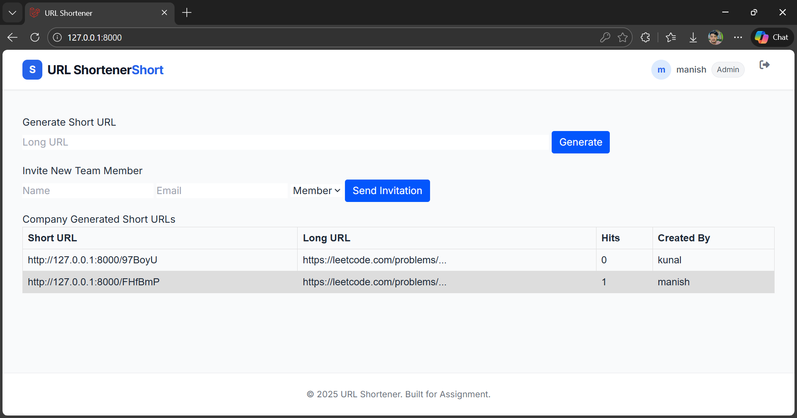
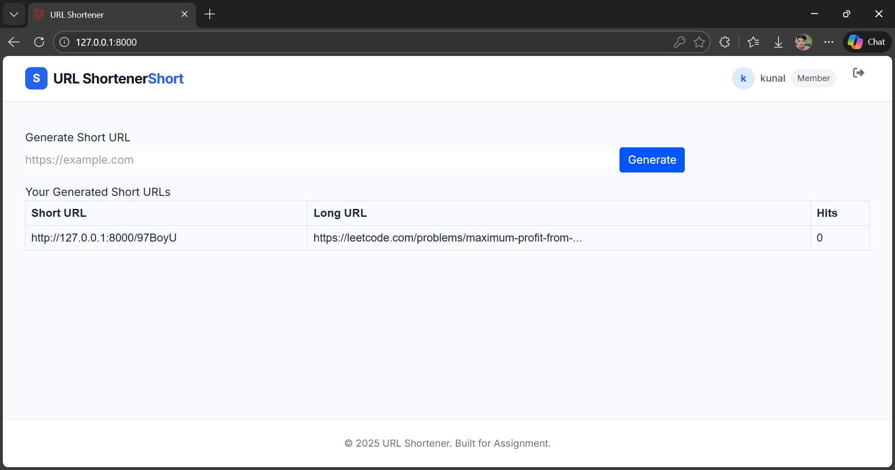

## URL Shortener

A robust, multi-tenant URL shortening service built with Laravel 11 and SQLite. This application features Role-Based Access Control (RBAC), organization management, and secure URL redirection.


## Core Functionality

- **URL Shortening:** Generates unique 6-character short codes for long URLs.

- **Redirection:** Instant redirection to original destinations with hit tracking.

- **Hit Counter:** Tracks the number of clicks for every shortened link.


## Architecture & Security

- **Multi-Tenancy:** Users and URLs are strictly scoped to specific Companies (Clients).
  

## RBAC (Role-Based Access Control):

- **Super Admin:** System-wide oversight. Can invite Clients but cannot create URLs.

- **Company Admin:** Manages their specific company. Can invite members and create URLs.

- **Team Member:** Can only create and view their own URLs.


## ⚙️ Installation & Setup
Follow these steps to set up the project locally for testing.

**Prerequisites**

- PHP >= 8.2
- Composer
- Git


**1. Clone the Repository**

```bash
git clone [https://github.com/YOUR-USERNAME/url-shortener.git](https://github.com/YOUR-USERNAME/url-shortener.git)
cd url-shortener
```


**2. Install Dependencies**

```bash
composer install
```


**3. Environment Configuration**

Copy the example environment file.

```bash
copy .env.example .env
```


Open .env and configure it for SQLite (ensure MySQL settings are removed or commented out):

```bash
DB_CONNECTION=sqlite
# DB_HOST=127.0.0.1
# DB_PORT=3306
# DB_DATABASE=laravel
# DB_USERNAME=root
# DB_PASSWORD=
```

**4. Create Database File**

Create the SQLite database file in the database directory.

- Windows (CMD): type nul > database/database.sqlite

- Mac/Linux: touch database/database.sqlite


**5. Application Key & Migrations**

Generate the app key and run the migrations with seeders. This creates the database structure and the default Super Admin account.

```bash
php artisan key:generate
php artisan migrate:fresh --seed
```


**6. Run the Application**

Start the local development server.

```bash
php artisan serve
```


Access the application at:  Server running on [http://127.0.0.1:8000]

## 🔑 Default Credentials

The database seeder creates the initial Super Admin account for you.

| Role          | Email               | Password |
| :------------ | :------------------ | :------- |
| **Super Admin** | `super@example.com` | `password` |
| **Admin** | `admin@example.com` | `password` |
| **Member** | `user@example.com`  | `password` |


## 📖 Workflows

__1. Super Admin Workflow__

- Log in as super@example.com.

- Use the "Invite New Client" form to create a new Company and its first Admin (e.g., Company: "Google", Admin Email: admin@google.com).

- Note: Super Admins strictly cannot generate short URLs.


__2. Company Admin Workflow__

- Log in with the email created in step 1.

- Use "Generate Short URL" to create links.

- Use "Invite New Team Member" to add staff to your company.


__3. Member Workflow__

- Log in with the invited member email.

- Generate Short URLs.

- View only the history of URLs you created.

## Screenshots

**Login Page**




**Super Admin Dashboard**


**Admin Dashboard**




**Member Dashboard**




